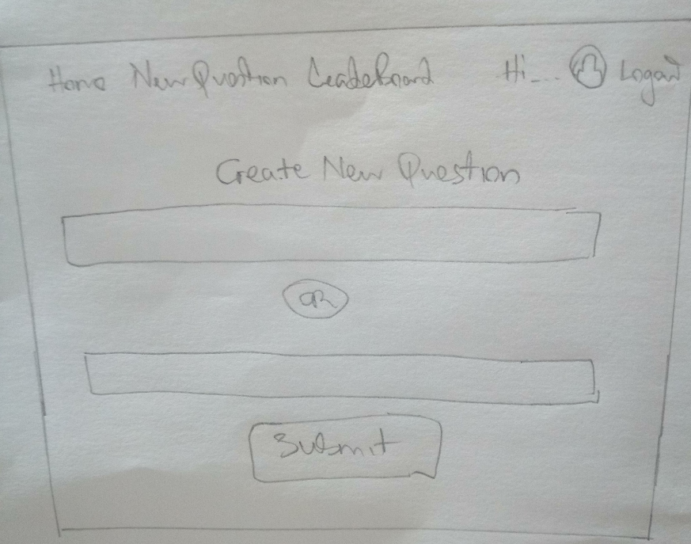

# Udacity Project: Would You Rather?

### Step 1 - Identify Each View
In this step, I will determine the look and functionality of each view in the app. I will be using paper and pencil instead of [mockup softwares](https://codingsans.com/blog/mockup-tools) to draw each view of the app so that I have a good idea of what information and data each view will need

#### View for the Login Page

##### Login View Requirements
- Is located at the route (`/login`)
- Shows welcome message, logo and login instructions.
- It displays a group of users to log in as 
- It displays a log in button that logs the selected user into the app.
- It displays the previously logged in user after log out.
- Displays the Navigation view at the top

#### View for the Home Page(Dashboard)

##### Home View Requirements
- Is located at the route (`/`)
- Shows questions arranged from the most recently created(top) to the least recently created(bottom).
- Questions are categorized into `answered` and `unanswered`. User is able to toggle between his/her answered and unanswered questions with the unanswered questions shown by default.
- Displays the number of questions in each category
- Displays the Navigation view at the top

#### View for the Leader Board Page

##### LeaderBoard View Requirements
- Is located at (`/leaderboard`)
- Displays the total number of users appearing in the leaderboard
- Displays user's details such as:
    - User's name
    - User's picture
    - Number of questions the user asked
    - Number of questions the user answered
    - Total score for number of answered and asked questions

### View for the New Question Page

##### New Question View Requirements
- Is located at (`/add`)
- has 2 input fields to add the two options

### View for the Poll page - Unanswered Polls

##### Unansweted poll view Requirements
- Display details of the user who asked the question
    - User name and picture
    - Date the question was aked
- Display the two options for the questions

### View for the Poll page - Answered Polls

##### Answered poll view Requirements
- Display details of the user who asked the question
    - User name and picture
    - Date the question was asked
- Display the two options with the following:
    - Text of the option
    - Number of people who voted for the option
    - Percentage of people who voted for that option
- Displays the overall number of votes

