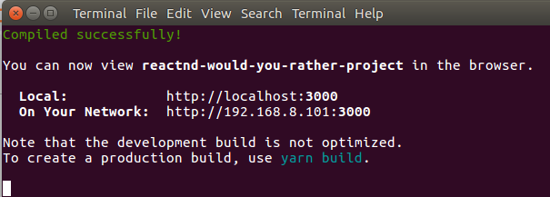
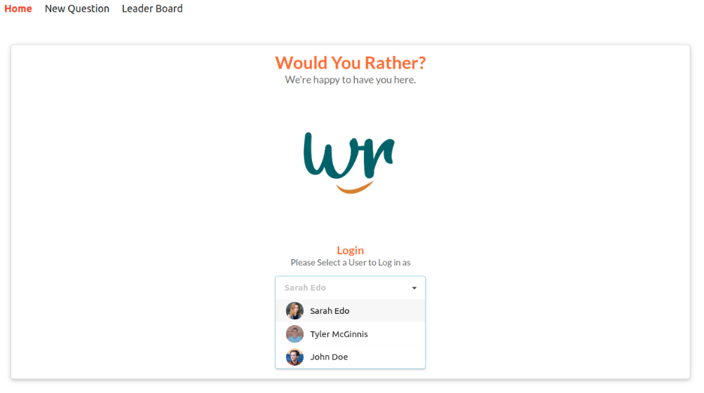
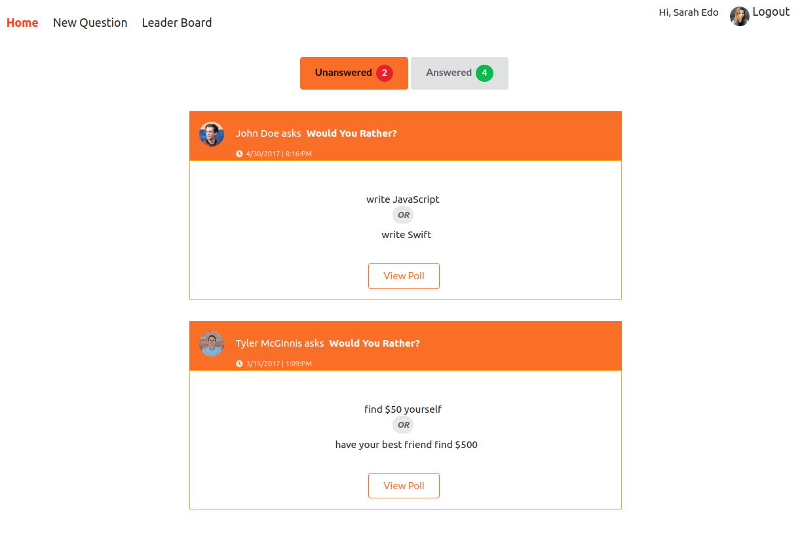
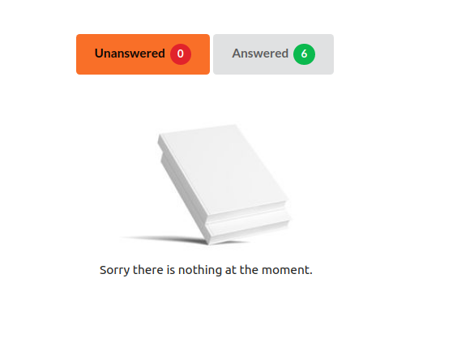
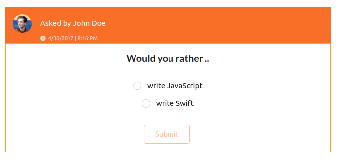
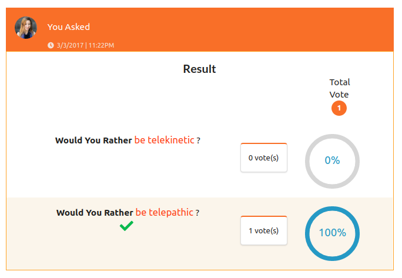
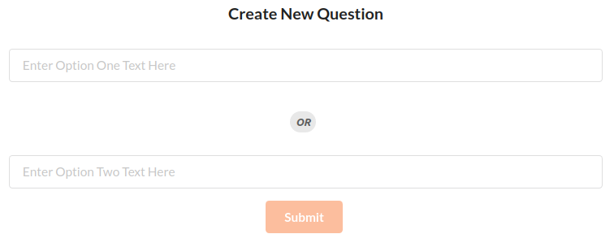
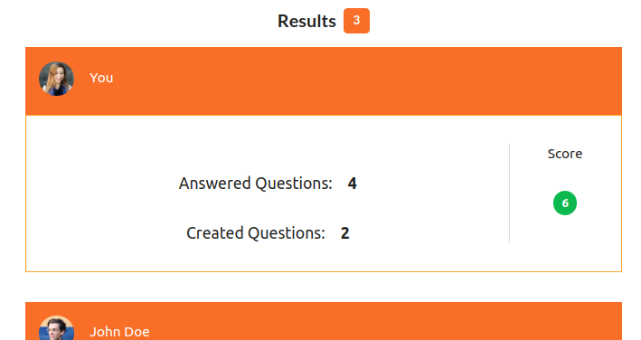
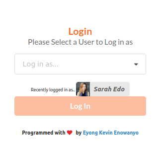
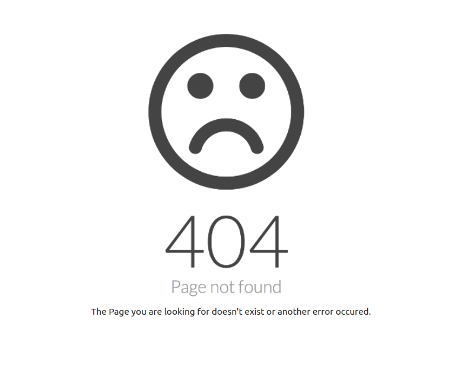

# Udacity Project: Would You Rather?

**Would You Rather** is a Udacity project that allow users to ask and answer questions, 
see how other people have voted the answers and also see the ranking of users.

>>>The UI is designed with semantic-ui-react 

## How To Run
- Git clone this project repo and navigate to the root of the project and run the following command to install all packages `npm install`
- Run this command to launch the app `npm start` or `yarn start`. This will start the server on `http://localhost:3000`

## Planning Stages
Before building the project, I will plan the various steps that will be used throughout the project. These steps are:
- Step 1 - [Identify Each View](public/docs/PLANNING_STAGE.md)
- Step 2 - Break Each View Into a Hierarchy of Components [`Under Development`]
- Step 3 - Determine What Events Happen in the App [`Under Development`]
- Step 4 - Determine What Data Lives in the Store [`Under Development`]

## How It Works
The app has the following functionalities:

### One can log in with the pre-defined users
We have 3 pre-defined users that one can log into the app as. As seen below, we can see the users names and avatars

### A User can see all asked questions and also questions he/she has answered
Once a user logs in, the first thing that appears is the dashboard that shows the list of answered and unanswered questions. 

If for any of the categories, no question is available, the following message will be displayed 

On this page, the user can do two things, 
#### Answer questions

#### View answered questions details
Here, the user can see what option he selected for the question which is indicated with a green tick and light-orange back-ground color. And how many users voted each options and the percentage of votes 

### A User can ask a question
It is no fun to answer questions when you can't ask yours. Hence, a User can ask questions for him and others to answer

### A User can see the ranking base on the number of question asked and answered
Here, we can see how many Users fiture in the leaderboard and their ranking. The score is the summation of the number of questions answered and asked

### A User can log out of the app and the app will keep track of the recently logged in user
Once a User logs out, the login page will display with details of the recently logged in user.

## Security 
The app has some couple of security put in place to make sure that the app doesn't crash. 
- If a one tries to navigate the manu but is not logged in, only the login page will be displayed to remain him to log in first
- If a logged in user tries a wrong URL, a 404 error page will be displayed. 

## Issue Faced
I had the follwoing warning message from the terminal

From the instructions, it says I should run the command `npx react-codemod rename-unsafe-lifecycles` in your project source folder to fix the issue. I did that but it didn't fix the issue. Bellow is the terminal after running the command

I don't think it comes from my code, it is surely because of the version of react I am using . This is because I am not using `componentWillReceiveProps` in my code

## References
- [Semantic UI React](https://react.semantic-ui.com)
- [mapStateToProps](https://react-redux.js.org/using-react-redux/connect-mapstate)
- [connect](https://react-redux.js.org/api/connect)
- [Normalizing State Shape](https://redux.js.org/recipes/structuring-reducers/normalizing-state-shape/)