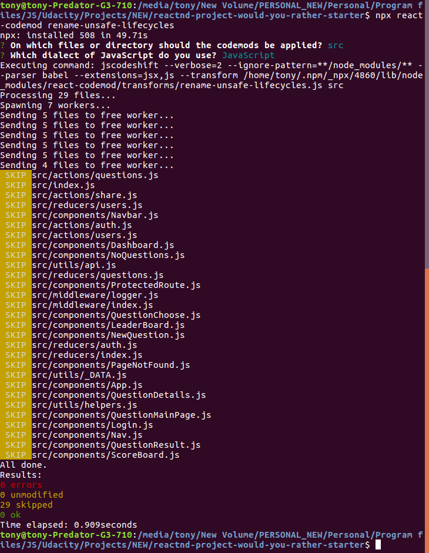

# Udacity Project: Would You Rather?

**Would You Rather** is a Udacity project that allow users to ask and answer questions, 
see how other people have voted the answers and also see the ranking of users.

## How It Works
- One can log in with the pre-defined users
- A User can see all asked questions and also questions he/she has answered
- A User can ask a question
- A User can see the ranking base on the number of question asked and answered

## How To Run
- Git clone this project repo and navigate to the root of the project and run the following command to install all packages `npm install`
- Run this command to launch the app `npm start` or `yarn start`

## Planning Stages
Before building the project, I will plan the various steps that will be used throughout the project. These steps are:
- Step 1 - [Identify Each View](public/docs/PLANNING_STAGE.md)
- Step 2 - Break Each View Into a Hierarchy of Components [`Under Development`]
- Step 3 - Determine What Events Happen in the App [`Under Development`]
- Step 4 - Determine What Data Lives in the Store [`Under Development`]

## Issue Faced
I had the follwoing warning message from the terminal

From the instructions, it says I should run the command `npx react-codemod rename-unsafe-lifecycles` in your project source folder to fix the issue. I did that but it didn't fix the issue. Bellow is the terminal after running the command

I don't think it comes from my code, it is surely because of the version of react I am using . This is because I am not using `componentWillReceiveProps` in my code

